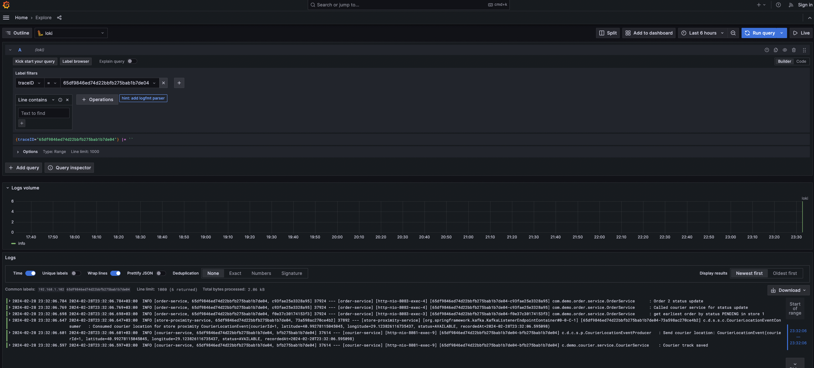

# Courier tracking project

The main technologies I used in the courier tracking system project are listed below.

## Technologies Used

* Java 17
* Springboot 3
* Feign Client
* Apache Kafka
* Swagger
* PostgreSQL
* Mongodb
* Docker
* Zipkin
* Grafana
* Mapstruct
* Micrometer

## Architecture Diagram


## Running on Your Computer

Navigate to the project directory in the terminal

```bash
  cd courier-tarck-project
```

* The docker-compose.yml file contains configurations for Kafka, Grafana, Zipkin, PostgreSql, Mongodb, Zookeeper, Tempo, and Loki.

You can start these tools with the following command:

```docker
  docker-compose up -d
```

## Let's run the application step by step on Swagger and see the flow.

* First, let's run courier service, order service and store proximity service on your local.

### Create Courier Example

* __Courier service__ : <http://localhost:8081/swagger-ui/index.html#/>

```json
{
  "identityNo": "12342323423",
  "firstName": "courier1",
  "lastName": "test"
}
```


### Create Order Example

* store.json file in (store-proximity-service/src/main/resources/stores.json)
* __Order service__ : <http://localhost:8083/swagger-ui/index.html#/>

```json
{
  "storeId": 1,
  "latitude": 40.99454,
  "longitude": 29.5454
}
```


### Courier send location and the business logic that occurs when this service runs

* In this service, the courier sends their location information, which is then saved to the courier_track table. Subsequently, the sent location is produced to the Kafka couriersLocation topic.
* Subsequently, the store proximity service consumes the courierLocation Kafka topic, and after the necessary checks are made in this service, the courier checks into the store to pick up the order. Afterward, the status of both the courier and the order is updated.

__/couriers/{id}/location__

```json
{
  "latitude": 40.99278115045045,
  "longitude": 29.123826116735437
}
```


### Courier updates status after delivery

* When the courier arrives at the address where the order was placed, they will send a request to this endpoint. The request will include the orderId, their courierId, and the courier's location. In terms of business logic, if the courier's location is within 5 meters or less of the order's location, the courier will set themselves as available, and the status of the order will be updated to delivered.

__/couriers/{id}/status/{orderId}/order-status__

```json
{
  "latitude": 40.99454,
  "longitude": 29.5454
}
```


### Log Tracing with Grafana

* Connect to Grafana using the address <http://localhost:3000>
* Thanks to the micrometer library I'm using, I can transfer the traceId between microservices, making log tracking easier. You can find a more detailed explanation on my GitHub account.


* For example, let's observe the steps it follows when I trigger the courier location service by querying with a traceId



>  [My Repository for Log Tracing](https://github.com/ErayMert/microservice-log-tracing)
